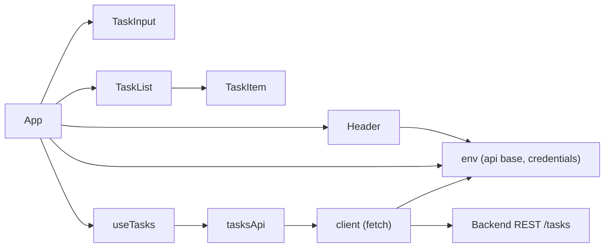

# To-Do Frontend (React) – Architecture Overview

## System Overview
The To-Do Frontend is a single-container React SPA that renders a task management UI and communicates with a planned backend service via RESTful endpoints under a configurable API base. It favors a small dependency footprint, CSS variable–driven theming, and an API layer built on the Fetch API with simple retry/backoff logic. The application is designed to remain usable when the backend is temporarily unavailable through optimistic UI updates and subtle rollbacks.

## Component Architecture
- App (src/App.js): Root shell that wires together Header, TaskInput, and TaskList. It manages theme, reads feature flags, and renders optional error alerts when verbose mode is enabled.
- Header (src/components/Header.js): Displays title, counters, refresh action, and theme toggle. Optionally shows a health banner if enabled via feature flag and REACT_APP_HEALTHCHECK_PATH.
- TaskInput (src/components/TaskInput.js): Accepts new task titles and triggers add. Supports Enter to submit and Escape to clear.
- TaskItem (src/components/TaskItem.js): Renders a single task with toggle, inline edit, and delete. Keyboard accessible and uses blur to save.
- TaskList (src/components/TaskList.js): Renders tasks or shows loading/empty states with ARIA semantics.

State is centralized in a custom hook, useTasks (src/state/useTasks.js), which coordinates initial loading, CRUD actions with optimistic updates, and subtle error handling.

## State Management Approach
useTasks encapsulates:
- State: tasks[], loading, error.
- Initialization: On mount, fetch tasks; on failure, schedule a background retry with exponential backoff.
- Actions:
  - refresh(): Refetch tasks and update state.
  - addTask(title): Optimistic insert with temporary ID; replace or rollback based on API result.
  - updateTask(id, updates): Optimistic field updates; replace or rollback.
  - deleteTask(id): Optimistic removal; rollback on failure.
  - toggleComplete(id): Optimistic completion toggle; rollback on failure.
Errors are recorded internally and optionally displayed when verboseErrors is enabled.

## Data Models
### Task entity (from UI perspective)
- id: string | number (unique identifier)
- title: string (non-empty after trimming)
- completed: boolean

### UI State
- tasks: Task[]
- loading: boolean
- error: string | null (used for diagnostics and optional alert in verbose mode)

## API Contracts
The API client composes requests relative to the configured API base. The following REST endpoints are expected:
- GET /tasks → 200 [ { id, title, completed } ]
- POST /tasks { title } → 201 { id, title, completed }
- PUT /tasks/{id} { title?, completed? } → 200 { id, title, completed }
- PATCH /tasks/{id} { completed } → 200 { id, title, completed }
- DELETE /tasks/{id} → 204 (or 200)

Client behavior:
- Returns parsed JSON or null on failure after retries.
- Retries transient network and 5xx responses using exponential backoff.
- 4xx responses are not retried and result in null.
- Optional credentials inclusion via REACT_APP_ENABLE_CREDENTIALS.

## Environment Variables Mapping
Primary variables used by the frontend:
- REACT_APP_API_BASE: Preferred API base URL (e.g., https://api.example.com or /api).
- REACT_APP_BACKEND_URL: Fallback API base if REACT_APP_API_BASE is unset.
- REACT_APP_FRONTEND_URL: Used to resolve relative WebSocket URLs.
- REACT_APP_WS_URL: Placeholder WebSocket URL for future real-time updates.
- REACT_APP_HEALTHCHECK_PATH: Optional path (e.g., /healthz) for health banner probe.
- REACT_APP_FEATURE_FLAGS: JSON string (e.g., {"verboseErrors":true,"healthcheckBanner":true}).
- REACT_APP_ENABLE_CREDENTIALS: "true" enables cross-origin credentials in fetch.

Available but not currently integrated:
- REACT_APP_NODE_ENV, REACT_APP_NEXT_TELEMETRY_DISABLED, REACT_APP_ENABLE_SOURCE_MAPS, REACT_APP_PORT, REACT_APP_TRUST_PROXY, REACT_APP_LOG_LEVEL, REACT_APP_EXPERIMENTS_ENABLED.

## Styling and Theming
- CSS variables define the visual design in src/styles/theme.css and src/index.css.
- Light theme (default) aligns with the style guide:
  - primary #3b82f6, secondary #64748b, success #06b6d4, error #EF4444
  - background #f9fafb, surface #ffffff, text #111827
- Dark mode is toggled by setting data-theme="dark" on documentElement. The Header provides a theme toggle.

## Error Handling and Loading States
- Loading state: aria-live polite loading message.
- Empty state: Subtle helper text when no tasks are present.
- Errors: API client returns null on failure; useTasks performs rollbacks and sets an error string. App displays inline alerts when verboseErrors is enabled. Console warnings are also gated by verboseErrors.
- Health banner: When enabled, Header performs a GET request to the configured health path and shows a simple status indicator; errors are silent.

## Routing (SPA Considerations)
- The application is a single page rendered under App without client-side routing. Future filters or views may introduce react-router (or similar) if needed.

## Telemetry and Logging
- REACT_APP_LOG_LEVEL is not currently used but reserved to control verbosity in future.
- verboseErrors feature flag enables console warnings and inline alerts.
- REACT_APP_NEXT_TELEMETRY_DISABLED is present for parity but does not affect Create React App.

## Build and Deployment Considerations
- Tooling: Create React App (react-scripts) with scripts for start, test, and build.
- Port: Defaults to 3000 during development.
- Environment: REACT_APP_* variables are read at build time; restart the dev server after changes to .env.
- CORS and credentials: Managed by backend; client can include credentials if REACT_APP_ENABLE_CREDENTIALS is "true".

## System Dependencies and Assumptions
- Backend Service: Provides REST endpoints under REACT_APP_API_BASE. Responses are JSON encoded and include id/title/completed fields.
- Database: Managed by the backend; not included in this frontend container.
- GraphQL: Not implemented; future enhancement could introduce a GraphQL client with minimal changes to the API layer.

## Future Enhancements
- Filtering and search across tasks.
- Real-time sync (WebSocket) using REACT_APP_WS_URL.
- Authenticated sessions and protected endpoints.
- Offline support and caching strategies.
- Internationalization and localization.
- Enhanced logging and telemetry using REACT_APP_LOG_LEVEL and an error reporting integration.

## Mermaid Diagram (Component and Data Flow)

---
Sources:
- to_do_frontend/src/App.js
- to_do_frontend/src/components/Header.js
- to_do_frontend/src/components/TaskInput.js
- to_do_frontend/src/components/TaskItem.js
- to_do_frontend/src/components/TaskList.js
- to_do_frontend/src/state/useTasks.js
- to_do_frontend/src/api/client.js
- to_do_frontend/src/api/tasksApi.js
- to_do_frontend/src/utils/env.js
- to_do_frontend/src/styles/theme.css
- to_do_frontend/src/index.css
- to_do_frontend/README.md
