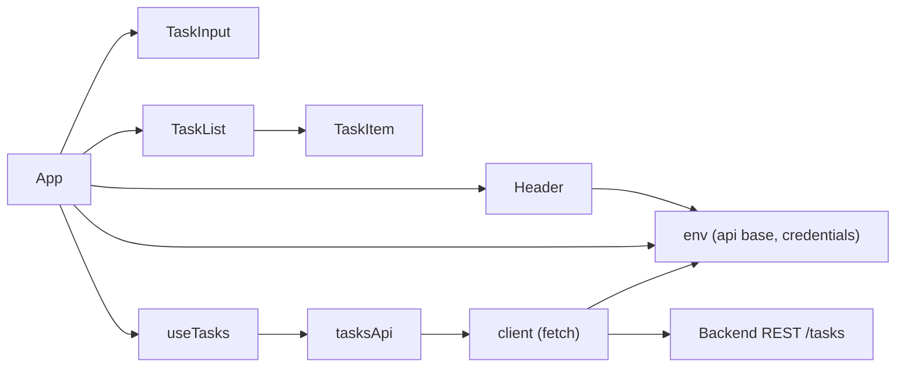

# To-Do Frontend Architecture

## Overview
This document describes the architecture of the To-Do List web application frontend built with React. It focuses on component structure, state management, API integration, environment configuration, theming, error handling, accessibility, performance considerations, and future extensions. The goal is to provide developers with a concise and actionable technical map aligned with the current codebase.

## Goals and Non-Goals
### Goals
- Provide a simple, resilient to-do experience with add, edit, delete, and complete actions.
- Keep the UI responsive and non-intrusive during network failures using optimistic updates and silent fallback behavior.
- Centralize configuration via environment variables with lightweight feature flags.
- Maintain a small dependency footprint with vanilla CSS theming and fetch-based API calls.

### Non-Goals
- Implement real-time synchronization (WebSockets are prepared as a configuration placeholder but not implemented).
- Provide advanced state libraries (Redux, Zustand) or router-based multi-page layouts.
- Implement complex error pages, i18n, or offline persistence.

## High-Level Architecture
The application is a single-page React app composed of:
- App (root shell) orchestrating theme, header, input, and list.
- A custom state hook useTasks that encapsulates task data, optimistic updates, and refresh logic.
- An API layer with a minimal fetch client and task-specific methods.
- Environment helper module for all runtime configuration and feature flags.
- CSS-based design system (theme.css and index.css).

High-level diagram description:
- App renders Header, TaskInput, and TaskList.
- App uses useTasks to retrieve tasks and expose CRUD handlers.
- useTasks calls api/tasksApi.js which delegates to api/client.js for HTTP.
- env.js provides configuration to api/client.js, Header, and App.
- theme.css and index.css provide styles and support dark/light via data-theme attribute.

## Component Architecture
- src/App.js: Root component that assembles the page:
  - Manages theme state and applies it via document.documentElement.setAttribute('data-theme', theme).
  - Reads feature flags to optionally display verbose errors.
  - Passes counts, theme toggles, and refresh action into Header.
  - Renders TaskInput and TaskList and wires them to useTasks actions.
- src/components/Header.js:
  - Displays app title, counts, refresh, and theme toggle.
  - Optional non-blocking healthcheck banner (feature-flagged).
  - Consumes getApiBase and getHealthcheckPath from env.js.
- src/components/TaskInput.js:
  - Text field and Add button with Enter/Escape keyboard handling.
  - Disabled state tied to loading.
- src/components/TaskItem.js:
  - Single task row with complete toggle, inline edit, and delete.
  - Inline edit is accessible and keyboard-operable.
- src/components/TaskList.js:
  - Lists TaskItem components, renders a subtle empty state or loading indicator.

## State Management Design (useTasks)
File: src/state/useTasks.js
- State: tasks (array), loading (boolean), error (string|null).
- Lifecycle:
  - On mount, fetch tasks via listTasks() and set loading false when done.
  - If the initial load fails (resolves to null), schedule a background silent retry with backoff.
- Actions:
  - refresh(): Fetch tasks and update state; silent failure results in empty list.
  - addTask(title): Optimistic insert a temp task; replace with server response or rollback on failure.
  - updateTask(id, updates): Optimistic patch; replace with server response or rollback on failure.
  - deleteTask(id): Optimistic delete; rollback on failure.
  - toggleComplete(id): Optimistic toggle; rollback on failure.
- Error Strategy:
  - error is tracked internally for optional verbose display (feature-flagged). Default UI remains subtle to avoid noisy failures.

## API Integration Layer
- src/api/client.js:
  - apiRequest(path, options): A minimal fetch wrapper:
    - Builds URL from getApiBase() and supports GET/POST/PUT/PATCH/DELETE.
    - JSON serialization/deserialization based on content-type.
    - Basic retry with exponential backoff for network and 5xx errors.
    - Supports timeout via AbortController.
    - Credentials mode controlled by getEnableCredentials().
    - Silent failure policy: returns null on most failures. When verboseErrors flag is enabled, logs warnings to console.
- src/api/tasksApi.js:
  - listTasks(): GET /tasks; returns array or [] if null.
  - createTask(title): POST /tasks; returns created task or null.
  - updateTask(id, updates): PUT /tasks/{id}; returns updated task or null.
  - deleteTask(id): DELETE /tasks/{id}; returns server response or null.
  - toggleTaskComplete(id, completed): PATCH /tasks/{id}; returns updated task or null.
- Assumed REST endpoints (aligned to current calls):
  - GET /tasks → 200 [ { id, title, completed } ]
  - POST /tasks { title } → 201 { id, title, completed }
  - PUT /tasks/{id} { title?, completed? } → 200 { id, title, completed }
  - PATCH /tasks/{id} { completed } → 200 { id, title, completed }
  - DELETE /tasks/{id} → 204 or 200

## Environment Configuration and Feature Flags
File: src/utils/env.js
- Primary variables used (subset of provided container_env):
  - REACT_APP_API_BASE, REACT_APP_BACKEND_URL: API base resolution, with fallback to '/api'.
  - REACT_APP_FRONTEND_URL: Used for resolving relative WS URL.
  - REACT_APP_WS_URL: Presently parsed and displayed only; no socket client.
  - REACT_APP_HEALTHCHECK_PATH: Optional health endpoint path (e.g., /healthz).
  - REACT_APP_FEATURE_FLAGS: JSON string for feature flags.
- Derived helpers:
  - getApiBase(): Chooses API base in priority order; trims trailing slashes.
  - getFrontendUrl(): Frontend base URL; normalized.
  - getWsUrl(): Normalizes a configured WS URL; supports relative resolution.
  - getEnableCredentials(): Enables fetch credentials mode when 'true'.
  - getFeatureFlags(): Parses JSON safely.
  - isVerboseErrorsEnabled(): Returns featureFlags.verboseErrors.
  - isHealthcheckBannerEnabled(): Returns featureFlags.healthcheckBanner.
- Suggested feature flags structure:
  - {"verboseErrors": true, "healthcheckBanner": true}
- Other container_env provided but not currently used by code:
  - REACT_APP_NODE_ENV, REACT_APP_NEXT_TELEMETRY_DISABLED, REACT_APP_ENABLE_SOURCE_MAPS, REACT_APP_PORT, REACT_APP_TRUST_PROXY, REACT_APP_LOG_LEVEL, REACT_APP_EXPERIMENTS_ENABLED.
  - These can be added in future to extend logging verbosity or build/runtime behavior.

## Theming and Styles
Files: src/styles/theme.css, src/index.css, src/App.css
- CSS variables define theme tokens (primary, secondary, success, error, background, surface, text, muted, border, radius, shadow).
- Dark mode is controlled via [data-theme="dark"] on documentElement set by App.
- Buttons, inputs, headers, cards, and task rows are styled via utility classes.
- Style guide alignment:
  - Primary: #3b82f6; Secondary: #64748b; Success: #06b6d4; Error: #EF4444; Background: #f9fafb; Surface: #ffffff; Text: #111827.
- No external CSS frameworks; small bundle and predictable styling.

## Error Handling Strategy
- Silent by default:
  - API errors return null and the UI presents a subtle empty state or keeps optimistic updates rolled back without blocking the user.
  - Background retries are used for initial load failures to reduce interruption.
- Feature-flagged verbosity:
  - When feature flag verboseErrors is true, App renders a small inline error alert with message and the API client logs warnings to the console.
- Healthcheck banner:
  - Feature-flagged healthcheckBanner enables a non-blocking health probe displayed in Header when REACT_APP_HEALTHCHECK_PATH is set.

## Accessibility Considerations
- Semantic roles and ARIA:
  - Header uses role="banner".
  - TaskList uses role="list"; TaskItem uses role="listitem".
  - Alerts use role="alert" with aria-live="assertive" when verbose mode is enabled.
  - Health banner uses aria-live="polite".
- Keyboard support:
  - TaskInput supports Enter to submit, Escape to clear.
  - TaskItem editing supports Enter to save and Escape to cancel; double-click or Enter can initiate editing; onBlur saves.
  - Buttons and inputs preserve accessible names via aria-label and title.
- Focus management:
  - Editing auto-focuses the input and selects text.

## Performance Considerations
- Minimal dependencies and no heavy UI libraries.
- Optimistic updates reduce perceived latency on CRUD.
- API client retries transient failures with backoff to smooth temporary issues.
- Conditional rendering avoids heavy reflows and keeps the DOM small.
- CSS only theming avoids runtime JS for styles beyond the data-theme toggle.

## Future Extensions
- WebSocket readiness:
  - getWsUrl() is in place for a future event-driven sync. Add a socket client and dispatch updates to useTasks to integrate real-time updates.
- Backend integration:
  - Extend client.js to include auth token headers if needed.
  - Add CSRF handling or credentials inclusion via getEnableCredentials().
- Observability and logging:
  - Use REACT_APP_LOG_LEVEL and REACT_APP_EXPERIMENTS_ENABLED in future to tune client verbosity.
- Caching:
  - Consider memoizing task collections or adding SW-based caching for read operations.
- Error telemetry:
  - Add a silent event reporter gated by feature flags or environment (e.g., only in production).

## File References and Interactions
- src/App.js:
  - Imports Header, TaskInput, TaskList, useTasks, and env helpers.
  - Applies theme and optionally shows verbose alert based on feature flags.
- src/state/useTasks.js:
  - Central state and handlers, calls into src/api/tasksApi.js.
- src/api/tasksApi.js:
  - Defines task REST calls and delegates to src/api/client.js.
- src/api/client.js:
  - Fetch wrapper using env helpers from src/utils/env.js.
- src/utils/env.js:
  - Single source of truth for environment variables and feature flags.
- Styles:
  - src/styles/theme.css provides component and theme tokens; src/index.css sets base layout; src/App.css adds minimal component-specific styles.

## Developer Quick Start
- Configure environment:
  - REACT_APP_API_BASE=https://api.example.com
  - REACT_APP_HEALTHCHECK_PATH=/healthz
  - REACT_APP_FEATURE_FLAGS={"verboseErrors":true,"healthcheckBanner":true}
- Run:
  - npm start
- Implement backend integration by ensuring the assumed REST endpoints match your API surface or adapting tasksApi accordingly.

## Mermaid Diagram
A simplified component and data flow:

---
Sources:
- src/App.js
- src/components/Header.js
- src/components/TaskInput.js
- src/components/TaskItem.js
- src/components/TaskList.js
- src/state/useTasks.js
- src/api/client.js
- src/api/tasksApi.js
- src/utils/env.js
- src/styles/theme.css
- src/index.css
- package.json

